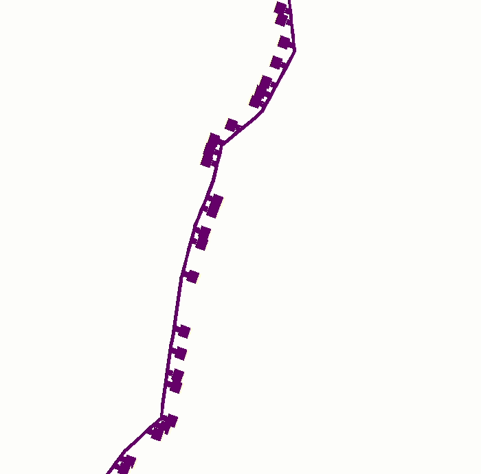

Morphological model of neuron with RxD ionic diffusion. Based on NEURON.

# Prerequisites
```bash
pip install git+https://github.com/ahwillia/PyNeuron-Toolbox.git
```


run: morpho_diffusion.py

* Example of Ca2+ diffusion from the spine head to the dendrite


* If you use any *.mod files - compile
```bash
nrmivmodl
```
* move x86_64 or i686 folder to the main folder of the project to use